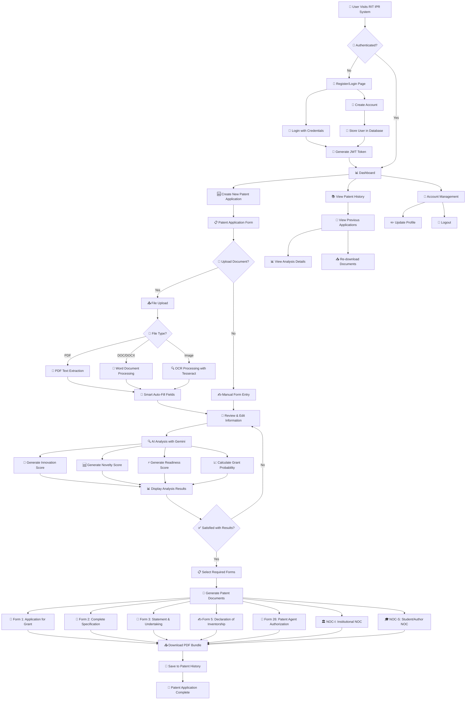
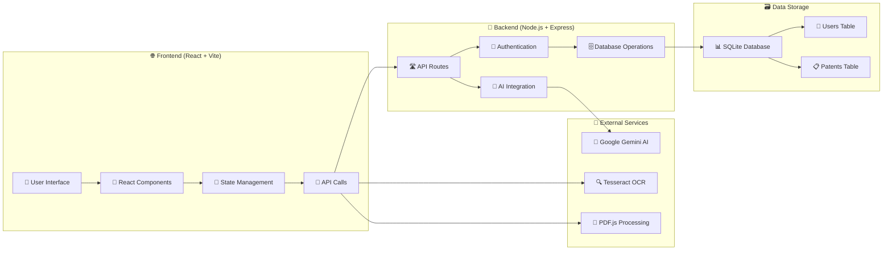
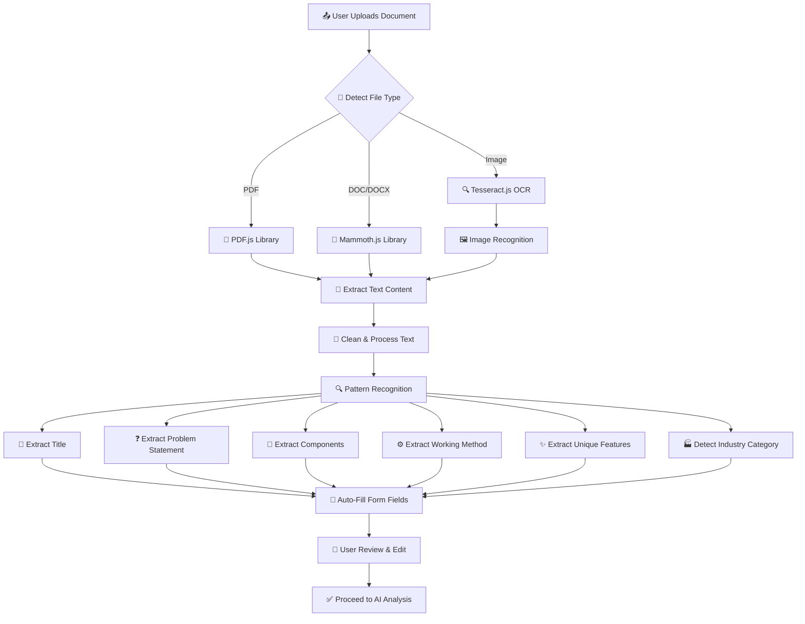
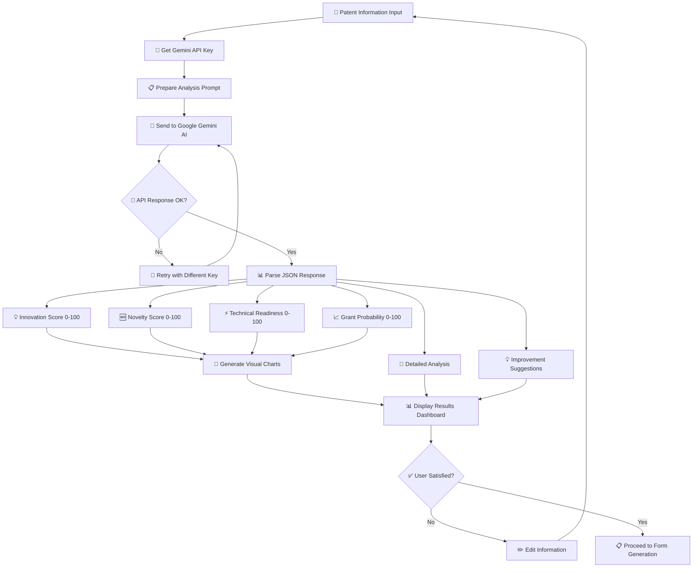
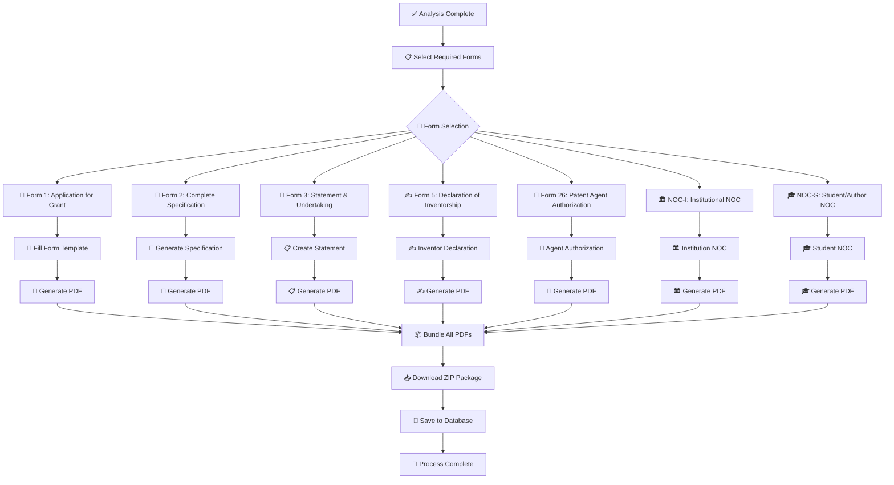
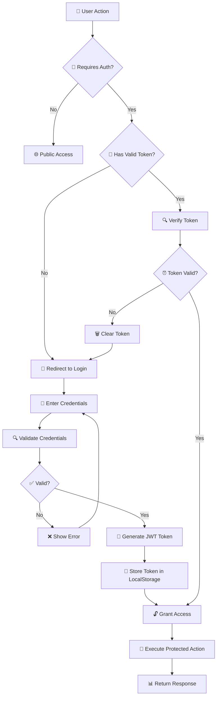
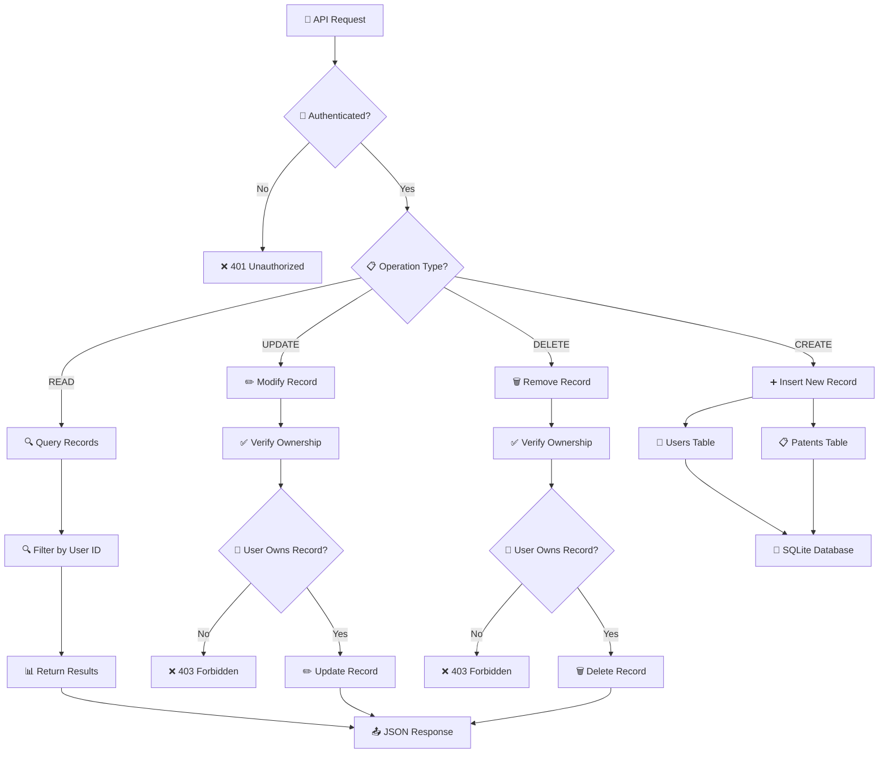
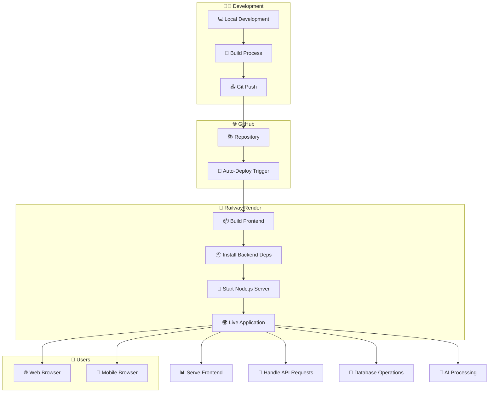

# 📊 RIT IPR Project Workflow - Mermaid Diagrams

## 🎯 Complete System Flow

---

## 🏗️ System Architecture Flow

---

## 🔄 Document Processing Pipeline

---

## 🤖 AI Analysis Workflow

---

## 📄 Form Generation Process

---

## 🔐 Authentication & Security Flow

---

## 💾 Database Operations Flow

---

## 🚀 Deployment Architecture

This comprehensive flowchart shows the complete workflow of your RIT IPR patent filing system, from user authentication through document processing, AI analysis, and form generation to final deployment architecture.